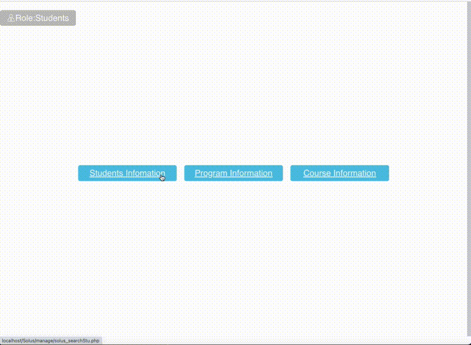

# Student System Website


## Description

The Student System Website is a comprehensive web-based application designed to manage student information, degree plans, and courses. The system features separate sections for students and administrators, allowing them to access and manage relevant information efficiently.

## Features

- **Student and Administrator Portals**: Separate entrances for students and administrators to access their respective sections.
- **Student Information Management**: Search, view, and edit student information.
- **Degree Plan Management**: View and manage degree plans.
- **Course Management**: View and manage courses.
- **Responsive Design**: The application is designed to be responsive and user-friendly on various devices.

## File Structure

- `index.php`: Main entrance of the system with links to student and administrator portals.
- `home.php`: Home page for the management section.
- `solus_searchStu.php`: Search for student information by student ID.
- `solus_listStu.php`: Display student information with pagination and search functionality.
- `solus_listPro.php`: Display degree plan information with pagination and search functionality.
- `solus_listCou.php`: Display course information with pagination and search functionality.
- `solus_stuInfo.php`: Display detailed student information.
- `solus_editStu.php`: Edit student information.
- `solus_enterStu.php`: Form for entering new student information.
- `solus_enterPro.php`: Form for entering new program information.
- `solus_enterCou.php`: Form for entering new course information.
- `css/main.css`: Contains CSS styling for the website.
- `includes/header.php`: Common header file included across multiple pages.
- `includes/footer.php`: Common footer file included across multiple pages.
- `students.php`: Handles student-specific functionalities.
- `admin.php`: Handles administrator-specific functionalities.
- `register.php`: User registration page.

## Getting Started

### Prerequisites

- PHP 7 or higher
- MySQL or any compatible database

### Installation

1. Clone the repository:
   ```bash
   git clone https://github.com/shallowManica/Student-System-Website.git

2. Navigate to the project directory:
  ```bash
  cd Student-System-Website

